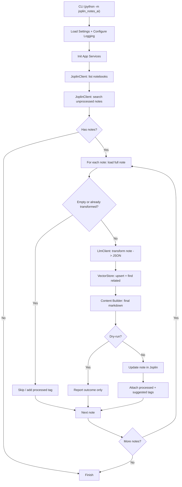

# joplin-notes-ai

`joplin-notes-ai` — это Python-сервис для автоматической обработки заметок в Joplin.
Он находит необработанные заметки, отправляет их в LLM для структурирования, добавляет семантические связи через ChromaDB и обновляет заметки обратно в Joplin с маршрутизацией по блокнотам и тегами.

## Что умеет

- Ищет заметки без специального тега обработки.
- Генерирует новую структуру и контент через LLM по JSON-контракту.
- Определяет связные заметки через векторный поиск (ChromaDB).
- Добавляет audit-блок и backup исходного текста в итоговую заметку.
- Перемещает заметку в целевой блокнот (`target_notebook`) и проставляет теги.
- Поддерживает безопасный запуск в режиме `--dry-run`.

## Технологический стек

- Python 3.12+
- Joplin Data API
- LLM API (по умолчанию DeepSeek-compatible endpoint)
- ChromaDB + Sentence Transformers
- Pydantic + pydantic-settings
- Loguru

## Установка и быстрый старт

```bash
uv sync
```

Создайте `.env`:

```env
JOPLIN_TOKEN=your_token
LLM_API_KEY=your_llm_key
```

Запуск:

```bash
python -m joplin_notes_ai
```

Совместимый legacy entrypoint:

```bash
python main_vector.py
```

CLI-опции:

- `--dry-run` — выполняет полный пайплайн без записи в Joplin и без `upsert` в ChromaDB.
- `--limit N` — ограничивает количество заметок за запуск.

## Конфигурация

Обязательные переменные:

- `JOPLIN_TOKEN`
- `LLM_API_KEY`

Основные опциональные переменные:

- `JOPLIN_BASE_URL` (default: `http://localhost:41184`)
- `LLM_BASE_URL` (default: `https://api.deepseek.com/v1`)
- `LLM_MODEL_NAME` (default: `deepseek-chat`)
- `PROMPT_FILE` (default: `system_prompt.txt`)
- `CHROMA_DB_PATH` (default: `./chroma_db`)
- `EMBEDDING_MODEL_NAME` (default: `all-MiniLM-L6-v2`)
- `SIMILARITY_THRESHOLD` (default: `0.8`)
- `SIMILARITY_TOP_K` (default: `5`)
- `REQUEST_TIMEOUT` (default: `90`)
- `LLM_TIMEOUT` (default: `90`)
- `PAUSE_BETWEEN_NOTES` (default: `1.5`)
- `MAX_RETRIES` (default: `2`)
- `RETRY_BACKOFF_SECONDS` (default: `0.8`)
- `LOG_FILE` (default: `logs/joplin_agent.log`)

## Зависимости

Runtime:

- `chromadb`
- `loguru`
- `pydantic`
- `pydantic-settings`
- `requests`
- `sentence-transformers`

Dev:

- `pre-commit`
- `ruff`
- `mypy`
- `detect-secrets`
- `nbstripout`
- `check-jsonschema`
- `bandit`
- `interrogate`

## Архитектура

Проект построен модульно:

- `joplin_notes_ai/config.py` — централизованные настройки.
- `joplin_notes_ai/cli.py` — CLI и bootstrap.
- `joplin_notes_ai/app.py` — orchestration уровня приложения.
- `joplin_notes_ai/clients/` — интеграционные клиенты:
- `joplin.py` для Joplin API
- `llm.py` для LLM API
- `vector_store.py` для ChromaDB
- `joplin_notes_ai/repositories/prompt_loader.py` — загрузка системного промпта.
- `joplin_notes_ai/services/` — бизнес-логика обработки заметок и сборка финального markdown.
- `joplin_notes_ai/models/` — доменные и контрактные модели.
- `joplin_notes_ai/exceptions.py` — типизированные ошибки.

### Общий принцип работы



## Качество и проверки

Запуск unit-тестов:

```bash
python -m unittest discover -s tests -v
```

Линтинг и форматирование:

```bash
uv run ruff check joplin_notes_ai tests main_vector.py
uv run ruff format joplin_notes_ai tests main_vector.py
```

Полный pre-commit прогон:

```bash
uv run pre-commit run --all-files
```

Установка git-хуков:

```bash
uv run pre-commit install
uv run pre-commit install --hook-type commit-msg
```
